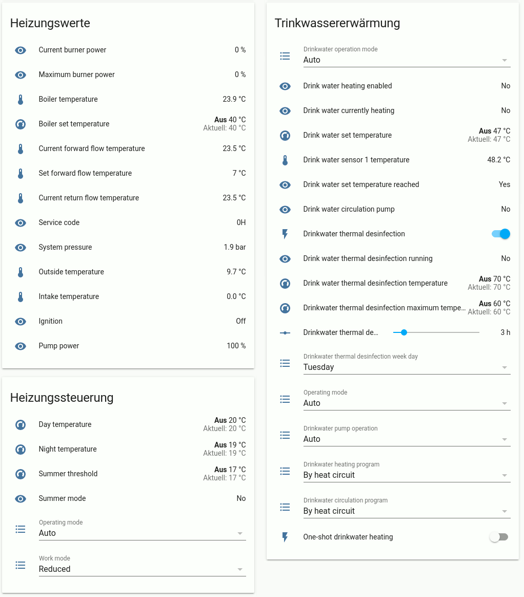

# Buderus EMS protocol driver
This is a Buderus EMS bus protocol stack for serial ports on Posix compatible systems.



## About

This is a protocol stack for the Buderus EMS bus. The project is basically split in three parts:

- A C driver to access the serial bus, implement the MAC layer (synchronizing with the bus master),
send and receive bus packets over a Posix Message Queue.
This is implemented in C because it is simply fast. It allows quick responds to the master
polling requests.

- A Python library to talk to the devices through the C driver. Here, the higher part of the
protocol is implemented. This is mainly definition of the messages, definition of their fields,
disassembling incoming messages and assembling changed fields into messages.

- An implementation for Home Assistant using the Python library.

## Requirements

* Heating hardware that uses the EMS bus
* Hardware access to the EMS bus.
  I can really recommend the board from [BBQKees](https://bbqkees-electronics.nl/)
* Linux (other Unix such as MacOS and Windows over Cygwin should also work after some adaption)
* A serial port with [parity bit support](#notes-on-the-serial-port)

### Notes for the Raspberry Pi

You have to use the pl011 port and not the mini UART. 
Read their [documentation](https://www.raspberrypi.org/documentation/configuration/uart.md) and 
[this description](#notes-on-the-serial-port) to understany why.

## EMS versions supported

Currently only EMS v1 is supported.

## Testing

I am using it on a Raspberry Pi with the PL011 serial port und OpenSuSE Tumbleweed aarch64.

My boiler is a Sieger BK15 and the thermostat a Sieger es73. These devices will definitvely work.

You are welcome to test this tool and take part on the development!

## Installation

To install the module in /usr:

```sh
python3 setup.py build
sudo python3 setup.py install
```

To install as user:

```sh
python3 setup.py build install --user
```

### Installing the home assistant component

Simply [install the module](#installation) and copy the component to HA:

```sh
cp -rv ./homeassistant/custom_components/ems_bus ~/.homeassistant/custom_components/
```

Do not forget to add the component to the `~/.homeassistant/configuration.yaml`:

```yaml
ems_bus:
    serial_path: /dev/ttyAMA0
    log_level: 3
```

The `log_level` is forwarded to `ems_serio`. See [here](#using-the-ems_serio-standalone-application)
for the log levels.

And probably you'll want some debug output as well in `~/.homeassistant/configuration.yaml`:

```yaml
logger:
  default: info
  logs:
    ems_serio: debug
    custom_components.emsbus: debug
    custom_components.emsbus.ems_bus: debug
    custom_components.emsbus.ems_protocol: debug
```

### Compiling the ems_serio standalone application

Currently, the Makefile only compiles, no install is supported

```sh
cd ems_serio
make -j4
```

## Usage

### Using the Home Assistant component

When added to the configuration and not throwing any exceptions, the component should start reading
the bus when Home Assistant starts. Configuration is done automatically.

#### When and how entities are added

The boiler typically detects the new device (ID 11) coming online by the polling messages and
broadcasts a [`UbaDevicesMessage`](ems_bus/ems_messages.py) (`0x07`) message type.
You should see these messages in the log:

```
(...) Device 08 came online. Requesting version.
(...) Device 09 came online. Requesting version.
(...) Device 11 came online. Requesting version.
(...) Device 16 came online. Requesting version.
```

This message is interpreted by the protocol driver. It adds the devices to an internal list and
queries the [`VersionMessage`](ems_bus/ems_messages.py) (`0x02`) from each bus address.
Their responses should also be seen in the log:

```
(...) Found a boiler at 0x08: ID 2, a Sieger BK13,BK15/Nefit Smartline/Buderus GB1x2 v2.7
(...) Found a controller at 0x09: ID 10, a BC10/RFM20 Receiver v2.7
(...) Found a thermostat at 0x10: ID 3, a Sieger ES73 v2.8
```

Whenever a message type, which is implemented in `ems_messages.py`, is seen for a device, which was
not seen before, a new entity is added for each field of this message into home assistant.

For example, the boiler sends a [`UbaMonitorSlow`](ems_bus/ems_messages.py) every few minutes. When
the message is seen the first time, the entities `outside_temp`, `boiler_temp`, `...`,
`burner_drinkwater` are added to Home Assistant.

To speed up the startup process, ems_devices.py defines a list `EMS_INITIAL_REQUESTS` of messages
which are queries for certain device types.

#### Changing values (writing to the bus)

`ems_messages.py` defines which messages are allowed to be written on the bus in `Meta.writeable`.
Fields of these messages are added as controlling fields of `climate`, `input_number`,
`input_select` and `switch`, read-only fields as `sensor` to HA.

By default, the set messages of boilers and thermostats are writeable.

### Using the ems_serio standalone application

Run the application as

```sh
./ems_serio [ttypath] [logmask]
```

Where

* ttypath is the path to the serial.
* logmask is a bit mask to control the log verbosity.

The log mask is defined in defines.h:

```c
#define LOG_ERROR 0x01   // Error messages
#define LOG_INFO 0x02    // Informational messages on start and stop
#define LOG_VERBOSE 0x04 // Verbose message on start and stop and bus timing
#define LOG_PACKET 0x08  // Output received and transmitted packets
#define LOG_MAC 0x10     // Output sync (token) information
#define LOG_CHAR 0x20    // Output single characters
```

Example:

```sh
./ems_serio /dev/ttyAMA0 7
```

The name of the RX queue is `/ems_bus_rx` and the name of the TX queue is `/ems_bus_tx`.

### Using the ems_bus Python 3 library
Define a call back function of incoming message updates of devices.

`def callback(type, device, message, updated_fields)`:

* type: 0 when the message was updated, 1 when the message was first seen for the device.
* device: Device info. See EmsDevice in ems_protocol.py.
* message: The instantiated and parsed message object. See ems_messages.py
* updated_fields: A list of updated fields. The items are instantiated objects of ems_fields.py

Then, you create an instance of `EmsProtocol(serial_port, log_level, client_id, callback, hass)`,
where:

* `serial_port`: is the path to the serial
* `log_level`: is the logmask as in ems_serio
* `client_id`: must be 11 (must match the hardcoded ID in ems_serio)
* `callback`: you call back function
* `hass`: an instance of Home Assistant, used for async functions. Set to None.

Finally, start an event loop and create a new task of `protocol.start()` inside it.
Beware that the event loop must not be closed, as it creates a sub task for the message reading
loop which would be closed with the loop.

Example:

```python
from ems_bus import ems_protocol
import logging
import asyncio

logging.basicConfig(level=logging.DEBUG)

async def callback(type, device, message, updated_fields):
    print('Update for message 0x{:02x} of {} device {} at address 0x{:02x}'.format(
        message.Meta.identification,
        'updated' if type == 0 else 'new',
        device.product[0],
        device.address))
    for field in updated_fields:
        print(str(field))
    print()

protocol = ems_protocol.EmsProtocol("/dev/ttyAMA0", 3, 11, callback, None)

loop = asyncio.get_event_loop()
loop.create_task(protocol.start())
loop.run_forever()
```

#### Directly run the ems_serio module

Import the ems_serio module from ems_bus. Use `ems_serio.start(ttypath)` to start the driver.

The module supports the same logging scheme as the standalone application does. To set the log
level, use `ems_serio.loglevel(level)`. The levels are available under the same name in the module.

`LOG_ERROR` and `LOG_INFO` are mapped to their respective Python logging levels. All other are
mapped to the debug level.

`loglevel()` deactivates bits which render into deactivated Python logging level. For example,
LOG_MAC gets disabled if the log level is not set to debug. The modified log level is returned by
`loglevel()`.

Example:

```python
from ems_bus import ems_serio
import logging
import posix_ipc

logging.basicConfig(level=logging.DEBUG)
LOGGER=logging.getLogger('ems_serio')
LOGGER.setLevel(logging.DEBUG)
ems_serio.loglevel(ems_serio.LOG_ERROR | ems_serio.LOG_INFO | ems_serio.LOG_VERBOSE)
ret = ems_serio.start("/dev/ttyAMA0")

rx_queue = posix_ipc.MessageQueue("/ems_bus_rx", 0, 0o666, 10, 32, True, False)
for i in range(10):
    message = rx_queue.receive()[0]
    print(message.hex())

ems_serio.stop()
```

## Thanks

This project was initially based on the rough
[Python script from Alexander Kabza](http://www.kabza.de/MyHome/EMSBus/EMSbus.html).

But not only him, also [Proddy's EMS-ESP code](https://github.com/proddy/EMS-ESP) for understanding
the serial access and also
[Ingo Fischer's EMS Wiki page](https://emswiki.thefischer.net/doku.php?id=start) was very helpful.
The messages were mainly implemented on his description.

Also to note BBQKees, who really simplified the whole hardware thing for me.

And of course thanks to the guys at mikrocontroller.net. I think the first information on the EMS
bus started to show up [there](https://www.mikrocontroller.net/topic/309075?page=single).

# Notes on the serial port

The EMS bus uses so called break signals to signal end of messages.
In classical unix terminology, a BREAK is a low signal for ~200 ms, independent of the bit rate.
On the EMS bus this is different, here a break is simply 9 bits of zeros (meaning 0,9375 ms of low
level at 9600 baud).

Luckily, at least on the RPi's PL011, this is long enough for the port to detect a break while
reading. The driver set `PARMRK` and unsets `IGNPAR` on the tty, so a break is sent as a three-byte
sequence of `0xff 0x00 x00`.

When sending, the driver simply enables (even) parity marking, writes a `0x00` and then disables
parity marking. This ends up the UART writing 9 bits of zeroes (8 for the `0x00` and 9 for the even
parity of `0x00`).

This is why the serial port needs parity marking. The termios parameters `PARMRK` and `PARENB` in
your driver in `linux/drivers/tty/serial` are an indication that it is supported.
